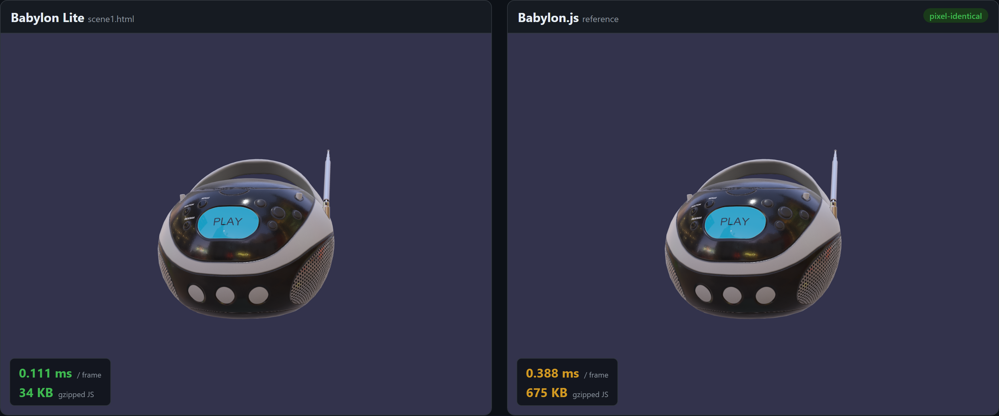
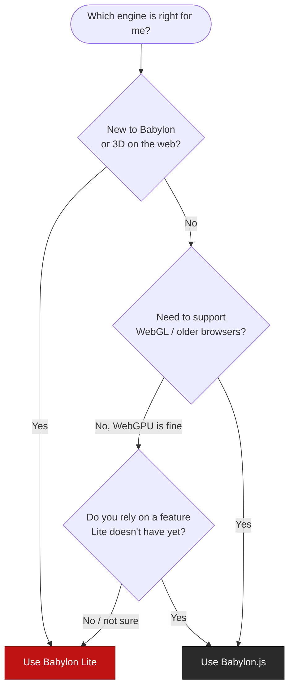

# Welcome to Babylon Lite

Babylon Lite is the engine we've always dreamed of building — a 3D engine started from a blank page, with no legacy to carry, built directly on top of modern GPU APIs and a modern toolchain.

It is a **WebGPU-exclusive, tree-shakable, data-oriented renderer**, engineered for an unprecedentedly small bundle size and high performance — while producing output that is **pixel-for-pixel identical to the beautiful rendering you've come to expect from Babylon.js**.

> **Babylon Lite is not a replacement for Babylon.js.** The two engines move forward side by side, as one family. They simply optimize for different things — so you can pick the right tool for the job.

---

## TL;DR — Which engine should I use?

| If you want…                                                                                  | Choose           |
| --------------------------------------------------------------------------------------------- | ---------------- |
| The smallest possible bundle size, the highest performance, ship-only-what-you-use            | **Babylon Lite** |
| The broadest feature set, WebGL **and** WebGPU support, and rock-solid backward compatibility | **Babylon.js**   |
| To **learn 3D on the modern web** from a clean, classless API                                 | **Babylon Lite** |
| To ship a **production app today** that depends on the full Babylon feature set               | **Babylon.js**   |

Still unsure? Jump to the [decision tree](#choosing-your-engine) below.

---

## What is Babylon Lite?

Babylon Lite is a ground-up rethink of a 3D engine for the modern web. A few ideas define it:

- **WebGPU exclusive.** Zero WebGL fallback, no legacy wrappers, no abstraction layers for older APIs. Lite is built entirely around WebGPU paradigms — render pipelines, compute shaders, bind groups, and command buffers.
- **No classes — pure data + functions.** Cameras, lights, meshes, and materials are plain state objects. Behavior lives in standalone, tree-shakable functions like `getViewMatrix(camera)` and `addToScene(scene, entity)`. Nothing carries hidden references, which means trivial serialization, zero circular dependencies, and maximum dead-code elimination.
- **Obsessively tree-shakable.** Every optional feature is an isolated module, dynamically imported only when a scene actually uses it. **Unused features cost zero bytes.** A simple scene ships a handful of KB; a complex PBR + IBL scene only pays for what it touches.
- **Modern toolchain.** Built on Vite, with WGSL shader minification in production bundles and strict, modern TypeScript throughout.

### Visually compatible — pixel-perfect with Babylon.js

This is the part we are most proud of. **Given the same scene setup, Babylon Lite and Babylon.js render the same pixels.**

We don't copy Babylon.js code — we understand the math and write the minimum code that reproduces the exact same image. Every parity scene is validated against a Babylon.js golden reference with an automated pixel-diff in CI: each scene renders in both engines, and we compute the **mean absolute difference (MAD)** per color channel (0–255 scale) against an immutable Babylon.js screenshot. The median across our suite is a MAD of **0.05** — effectively indistinguishable — and the threshold is enforced on every change, not eyeballed once.

That means you get **Babylon.js-quality visuals with Lite's footprint and speed**.

---

## The numbers

Measured live across our full parity test suite (100+ scenes), comparing the exact same scene built in each engine.

| Metric                       | Babylon Lite vs Babylon.js                                                                       |
| ---------------------------- | ------------------------------------------------------------------------------------------------ |
| **Bundle size** (gzipped JS) | **~19× smaller** on average (~30× smaller uncompressed); up to **50× smaller** on focused scenes |
| **Frame time** (RAF CPU)     | **~3–4× faster**                                                                                 |
| **Startup time**             | **~2.5× faster**                                                                                 |
| **Memory**                   | **~5× less**                                                                                     |
| **Visual output**            | Pixel-identical (median MAD 0.05)                                                                |

For the BoomBox PBR scene below, that's **34 KB vs 675 KB** gzipped (84.5 KB vs 2.8 MB raw) — the same image, a fraction of the download.

### Same scene, side by side



> _Left: Babylon Lite. Right: Babylon.js. Same model, same lights, same IBL — identical result, at a fraction of the size._

---

## The same scene in both engines

Moving a scene to Babylon Lite is meant to feel familiar. The API is different — there are no classes, and behavior lives in standalone functions rather than methods — but it is still similar in **shape and naming**, so the concepts carry over directly.

Here is the exact same BoomBox PBR scene shown above, in both engines.

### Babylon.js

```typescript
import { WebGPUEngine } from "@babylonjs/core/Engines/webgpuEngine";
import "@babylonjs/core/Helpers/sceneHelpers";
import { HemisphericLight } from "@babylonjs/core/Lights/hemisphericLight";
import { SceneLoader } from "@babylonjs/core/Loading/sceneLoader";
import { CubeTexture } from "@babylonjs/core/Materials/Textures/cubeTexture";
import { Vector3 } from "@babylonjs/core/Maths/math.vector";
import { Scene } from "@babylonjs/core/scene";
import "@babylonjs/loaders/glTF";

const engine = new WebGPUEngine(canvas, { antialias: true, adaptToDeviceRatio: true });
await engine.initAsync();
const scene = new Scene(engine);

const light = new HemisphericLight("hemi", new Vector3(0, 1, 0), scene);
light.intensity = 1.0;

await SceneLoader.ImportMeshAsync("", "https://playground.babylonjs.com/scenes/", "BoomBox.glb", scene);
scene.environmentTexture = new CubeTexture("https://assets.babylonjs.com/core/environments/environmentSpecular.env", scene);
scene.createDefaultCamera(true, true, true);
scene.createDefaultEnvironment({ createSkybox: true, createGround: true, skyboxSize: 1000 });

engine.runRenderLoop(() => scene.render());
```

### Babylon Lite

```typescript
import {
    createEngine,
    createSceneContext,
    createDefaultCamera,
    createHemisphericLight,
    loadGltf,
    loadEnvironment,
    addToScene,
    attachControl,
    registerScene,
    startEngine,
} from "babylon-lite";

const engine = await createEngine(canvas);
const scene = createSceneContext(engine);

addToScene(scene, createHemisphericLight([0, 1, 0], 1.0));
addToScene(scene, await loadGltf(engine, "https://playground.babylonjs.com/scenes/BoomBox.glb"));
await loadEnvironment(scene, "https://assets.babylonjs.com/core/environments/environmentSpecular.env", {
    groundTextureUrl: "https://assets.babylonjs.com/core/environments/backgroundGround.png",
    skyboxUrl: "https://assets.babylonjs.com/core/environments/backgroundSkybox.dds",
    skyboxSize: 1000,
});

const cam = createDefaultCamera(scene);
attachControl(cam, canvas, scene);

await registerScene(scene);
await startEngine(engine);
```

Notice the shape is the same: create an engine, build a scene, add a light, load a glTF, set up the environment and camera, then run. The difference is that Lite hands you **plain data plus tree-shakable functions** instead of classes and methods — which is exactly what lets the bundler strip everything you don't use.

> Ready to port a real scene? See the **[Porting Guide](01-porting-guide.md)** for a full side-by-side API map.

---

## Choosing your engine

Use this decision tree to find your starting point. There are no wrong answers — and because the APIs share the same shape, you can switch later knowing the pixels won't change.



### In plain language

**Reach for Babylon Lite when:**

- You're **just starting your Babylon journey** — Lite's clean, classless API is a great first step, and the concepts transfer directly to Babylon.js later.
- **Bundle size matters** — landing pages, embeds, ads, e-commerce, mobile web, or anywhere every kilobyte counts.
- **Performance matters** — you want the fastest frames, quickest startup, and lowest memory on WebGPU hardware.
- You're targeting **modern browsers only** and don't need a WebGL fallback.

**Reach for Babylon.js when:**

- You need to support **WebGL or older browsers** — Lite is WebGPU-only by design.
- You depend on a **feature Lite doesn't cover yet** — Babylon.js has the broadest, most mature feature set in the ecosystem.
- You're shipping a **production app today** and want a stable, battle-tested API surface.
- You want the **full toolbox**: the complete editor, Playground, Sandbox, and the entire extension ecosystem.

Babylon.js remains the right default for most projects today. Babylon Lite is the choice when you need the smallest bundle and the highest performance, with pixel-identical results.

---

## Good to know

A few honest notes so you can plan with confidence:

- **WebGPU only.** Lite runs anywhere WebGPU is available — Chrome and Edge 113+, and recent Firefox and Safari. There is no WebGL fallback, by design.
- **The API is young and may evolve.** Lite is fully open source and usable today. We'd love early adopters, with the caveat that some APIs can still change before we stabilize.
- **Backward compatibility is not a first-class goal.** That is the deliberate trade that buys Lite its size and speed. Lite is intentionally narrower and more opinionated than Babylon.js.
- **One scene, one engine.** They are separate engines, so a given scene is built with one or the other. But because the APIs share the same shape — and assets like glTF, `.env`, and textures carry straight across — choosing the engine that fits a project is low-risk.

---

## Frequently asked questions

**Which browsers does it run on?**
Babylon Lite is WebGPU-only, so it runs anywhere WebGPU is available: Chrome and Edge 113+, and recent Firefox and Safari. There is no WebGL fallback by design.

**Will Babylon.js features come to Lite?**
Yes — bringing Lite up toward Babylon.js feature parity is our top priority. Features land as isolated, tree-shakable modules, so the engine grows without bloating your bundle.

**Can I mix Babylon.js and Babylon Lite in one project?**
A given scene is built with one engine or the other. Because the APIs are similar in shape, the concepts and assets (glTF, `.env`, textures) carry straight across when you choose which engine fits a project.

**Is it production-ready? Is the API stable?**
Lite is young and the API may still evolve as we close the feature gap. It is fully open source and usable today — we'd love early adopters, with the caveat that some APIs can change before we stabilize.

**Does pixel-perfect mean exactly identical?**
It means **visually indistinguishable**, enforced by an automated per-scene MAD threshold in CI. The goal is Babylon.js-quality output you can't tell apart by eye.

---

## What's next

This is just the beginning. On the roadmap:

- **Feature parity with Babylon.js** — closing the gap so more scenes can be built in Lite without compromise.
- **A Lite Viewer** — a drop-in, ultra-light viewer for showcasing models and scenes with the smallest possible footprint.
- **A Lite Playground and Sandbox** — the tools you love from the Babylon ecosystem, reimagined for Lite.

And just as importantly: we want to **hear from you** — what's missing, what you'd need before reaching for Lite, and where it should go next. Your feedback will directly shape the roadmap.

---

## Next steps

- 📖 **[Porting Guide](01-porting-guide.md)** — translate a Babylon.js scene to Babylon Lite, side by side.
- 🧱 **[Architecture docs](architecture/)** — deep dives into the engine internals.
- 🌐 **[github.com/BabylonJS/Babylon-Lite](https://github.com/BabylonJS/Babylon-Lite)** — explore the code, browse the scene gallery, and follow along with development.

Star the repo, open an issue, and tell us what you'd want before reaching for Lite. **Two engines, one family, moving forward together** — pick the one that fits your project, and switch between them knowing the pixels won't change. 💙
